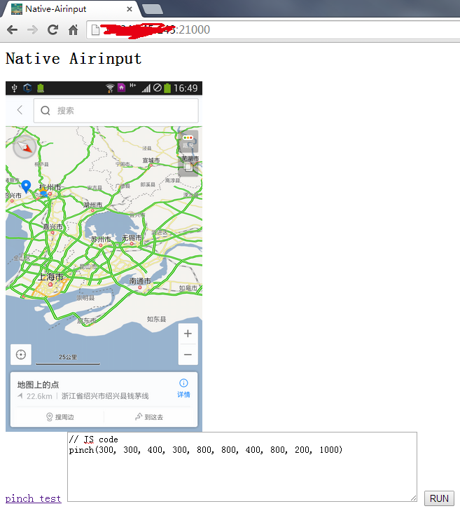

airinput
=====================
Simulate touch,drap,pinch for Android phone.

### The lib of go-airinput

### Distribution
I put a pre compiled file in **dist** folder

About the usage:

1. use `run.bat` to push file to your phone.
2. open browser `http://<phone ip addr>:21000`

### About
Still in develop, but the code is healthy. 

This code need Go1.4, follow [offical instruction](http://code.google.com/p/go/source/browse/README?repo=mobile) to setup environment.

A lot code is from <https://github.com/wlach/orangutan>, orangutan you are a great people.

use `sh build.sh` to build.

Sample code is in `main.go` now. 

Licence is under [MIT](LICENSE).
